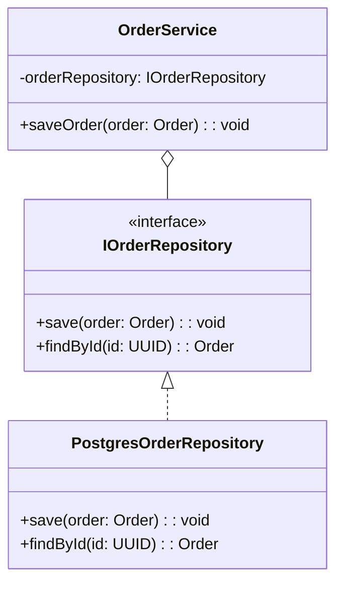

# Class Diagram

```mermaid
classDiagram
    class IOrderRepository {
        <<interface>>
        +save(order: Order): void
        +findById(id: UUID): Order
    }

    class PostgresOrderRepository {
        +save(order: Order): void
        +findById(id: UUID): Order
    }

    class OrderService {
        -orderRepository: IOrderRepository
        +saveOrder(order: Order): void
    }

    IOrderRepository <|.. PostgresOrderRepository
    OrderService o-- IOrderRepository
```
