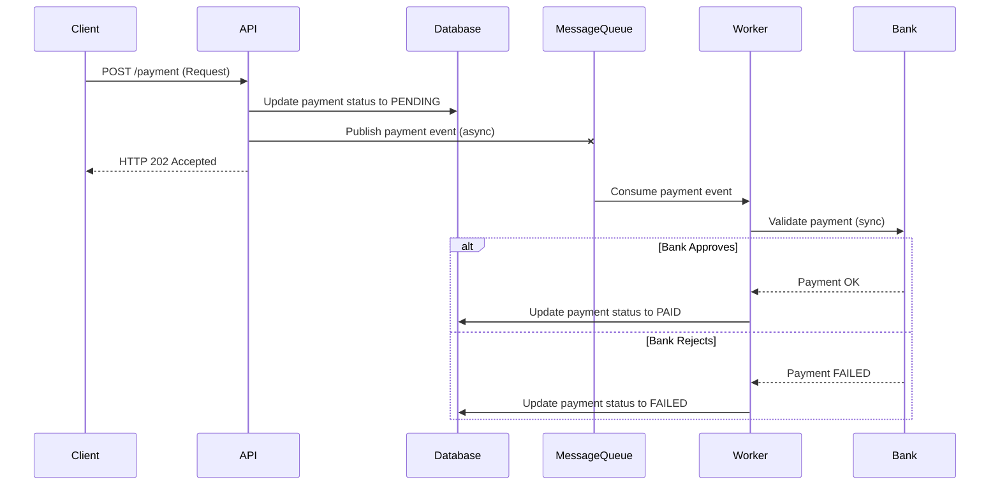

# Sequence Diagram

```mermaid
sequenceDiagram
    participant Client
    participant API
    participant Database
    participant MessageQueue
    participant Worker
    participant Bank

    Client->>API: POST /payment (Request)
    API->>Database: Update payment status to PENDING
    API-xMessageQueue: Publish payment event (async)
    API-->>Client: HTTP 202 Accepted

    MessageQueue->>Worker: Consume payment event
    Worker->>Bank: Validate payment (sync)

    alt Bank Approves
        Bank-->>Worker: Payment OK
        Worker->>Database: Update payment status to PAID
    else Bank Rejects
        Bank-->>Worker: Payment FAILED
        Worker->>Database: Update payment status to FAILED
    end
```
