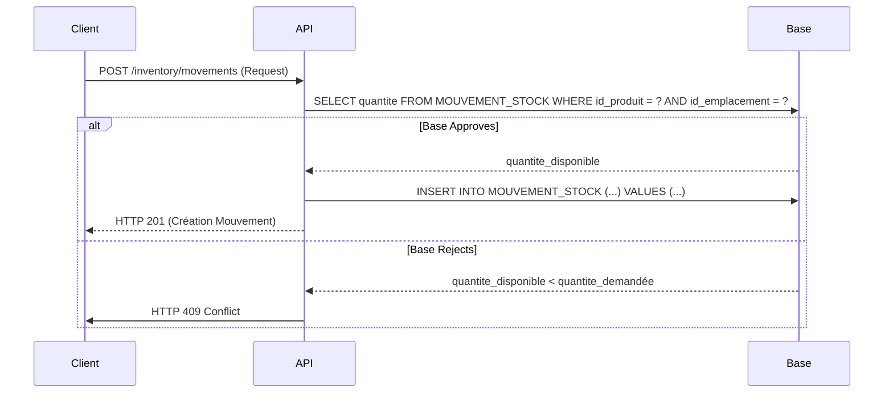

# Sequence Diagram

```mermaid
sequenceDiagram
    participant Client
    participant API
    participant Base

    Client->>API: POST /inventory/movements (Request)
    API->>Base: SELECT quantite FROM MOUVEMENT_STOCK WHERE id_produit = ? AND id_emplacement = ?

    alt Base Approves
        Base-->>API: quantite_disponible
        API->>Base: INSERT INTO MOUVEMENT_STOCK (...) VALUES (...)
        API-->>Client: HTTP 201 (Création Mouvement)
    else Base Rejects
        Base-->>API: quantite_disponible < quantite_demandée
        API->>Client: HTTP 409 Conflict
    end
```
